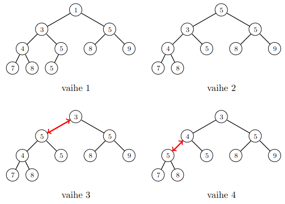

# 11. Lisää tietorakenteita

Tässä luvussa tutustumme kahteen tietorakenteeseen:

* _Pakka_ (_deque_): Pakka on listarakenne, jossa alkioiden lisäykset ja poistot ovat tehokkaita sekä listan alussa että lopussa.
* _Keko_ (_heap_): Keko on puurakenne, jossa pystyy lisäämään tehokkaasti alkioita sekä etsimään ja poistamaan pienimmän tai suurimman alkion.

Molemmat tietorakenteet ovat saatavilla Pythonin standardikirjastossa, minkä ansiosta niitä voi käyttää kätevästi Python-ohjelmoinnissa.

## Pakka

Pythonin tavallisessa listassa on tehokasta lisätä alkio listan loppuun sekä poistaa alkio listan lopusta käyttäen metodeja `append` ja `pop`. Kuitenkaan ei ole tehokasta tapaa lisätä tai poistaa alkiota listan alussa.

_Pakka_ (_deque_) on listarakenne, jossa sekä listan alkua että loppua pystyy käsittelemään tehokkaasti. Pythonissa pakka on saatavilla moduulissa `collections` tietorakenteena `deque`, joka tarjoaa seuraavat metodit:

* `append`: lisää alkio listan loppuun
* `pop`: poista alkio listan lopusta
* `appendleft`: lisää alkio listan alkuun
* `popleft`: poista alkio listan alusta

Tuttujen metodien `append` ja `pop` lisäksi pakassa on siis myös metodit `appendleft` ja `popleft`, joilla voi lisätä ja poistaa alkion listan alussa. Kaikkien näiden metodien aikavaativuus on $$O(1)$$.

Seuraava koodi esittelee pakan käyttämistä:

```python
import collections

items = collections.deque()

items.append(1)
items.append(2)
items.appendleft(3)
items.append(4)
items.appendleft(5)

print(items) # deque([5, 3, 1, 2, 4])

print(items[0]) # 5
print(items[1]) # 3
print(items[-1]) # 4
```

Pakka on toteutettu Pythonissa _linkitettynä listana_ (_linked list_), mikä tarkoittaa, että pakassa olevissa alkioissa on muistissa viittaus listan edelliseen ja seuraavaan alkioon. Tämän ansiosta on tehokasta lisätä ja poistaa alkioita. Toisin kuin tavallisessa listassa, alkioiden ei tarvitse olla peräkkäin muistissa.

Tarkastellaan esimerkkinä listan $$[1,2,3]$$ tallentamista tavallisena listana ja linkitettynä listana. Tavallisena listana tilanne voi näyttää tältä:

100 | 101 | 102 | 103 | 104 | 105 | 106 | 107 | 108 | 109 | 110 | 111
1 | 2 | 3 | 0 | 0 | 0 | 0 | 0 | 0 | 0 | 0 | 0

Tässä listan alkiot on tallennettu muistiin alkaen kohdasta 100. Alkiot ovat peräkkäin muistissa ja lisäykset ja poistot ovat tehokkaita vain listan lopussa.

Linkitettynä listanne tilanne voi puolestaan näyttää seuraavalta:

100 | 101 | 102 | 103 | 104 | 105 | 106 | 107 | 108 | 109 | 110 | 111
1 | 0 | 106 | 3 | 106 | 0 | 2 | 100 | 103 | 0 | 0 | 0

Tässä listan alkiot ovat kohdissa 100, 106 ja 103. Jokaisessa kohdassa on kolme tietoa: alkion sisältö, viittaus edelliseen alkioon ja viittaus seuraavaan alkioon. Esimerkiksi kohdassa 106 on arvot 2, 100, 103, koska alkion sisältö on 2, edellinen alkio on kohdassa 100 ja seuraava alkio on kohdassa 103. Viittaus 0 tarkoittaa, että alkiolla ei ole edellistä tai seuraavaa alkiota.

Linkitetyn listan etuna on, että alkioita voi lisätä ja poistaa joustavasti, koska alkioiden ei tarvitse olla peräkkäin muistissa. Esimerkiksi jos yllä olevassa tilanteessa listan alkuun halutaan lisätä uusi alkio, se voidaan lisätä muistiin kohtaan 109:

100 | 101 | 102 | 103 | 104 | 105 | 106 | 107 | 108 | 109 | 110 | 111
1 | 109 | 106 | 3 | 106 | 0 | 2 | 100 | 103 | 4 | 0 | 100

Tämä vastaa listaa $$[4,1,3,2]$$, jonka aloituskohta muistissa on 109.

Linkitetyn listan heikkoutena on, että indeksointi (`[]`) vie aikaa $$O(k)$$, missä $$k$$ on alkion etäisyys listan alusta tai lopusta. Niinpä indeksointi on tehokasta vain listan alussa ja lopussa. Pythonin tavallisessa listassa indeksointi vie aina aikaa $$O(1)$$, mutta pakassa indeksointi vie aikaa $$O(n)$$, jos indeksoitava kohta on listan keskellä.

## Pino ja jono

_Pino_ (_stack_) on tietorakenne, jossa pystyy lisäämään alkion listan loppuun sekä hakemaan tai poistamaan alkion listan lopusta. _Jono_ (_queue_) on puolestaan tietorakenne, jossa pystyy lisäämään alkion listan loppuun sekä hakemaan tai poistamaan alkion listan alusta.

Pakan avulla pystyy toteuttamaan tehokkaasti sekä pinon että jonon, koska alkioita voi käsitellä tehokkaasti sekä listan alussa että lopussa. Seuraavat luokat `Stack` ja `Queue` toteuttavat pinon ja jonon:

```python
import collections

class Stack:
    def __init__(self):
        self.stack = collections.deque()

    def push(self, x):
        self.stack.append(x)

    def top(self):
        return self.stack[-1]

    def pop(self):
        self.stack.pop()

class Queue:
    def __init__(self):
        self.queue = collections.deque()

    def push(self, x):
        self.queue.append(x)

    def top(self):
        return self.queue[0]

    def pop(self):
        self.queue.popleft()
```

Huomaa, että pinon voi toteuttaa helposti myös Pythonin tavallisen listan avulla, kuten teimme luvussa 6. Sen sijaan jonon toteutuksessa on aitoa hyötyä siitä, että pakkaa pystyy käsittelemään tehokkaasti sekä alussa että lopussa.

## Keko

_Keko_ (_heap_) on tietorakenne, jossa voi lisätä, hakea ja poistaa alkioita. Keko on toteutuksesta riippuen joko _minimikeko_ (_min heap_) tai maksimikeko (_max heap_). Minimikeossa voi hakea ja poistaa pienimmän alkion, kun taas maksimikeossa voi hakea ja poistaa suurimman alkion.

Pythonissa moduuli `heapq` sisältää funktioita, joiden avulla listaa voi käsitellä minimikekona:

* `heappush`: lisää kekoon uusi alkio
* `heappop`: poista ja palauta keon pienin alkio

Molemmat funktiot toimivat ajassa $$O(\log n)$$. Lisäksi listan ensimmäinen alkio on aina keon pienin alkio, joten sen pystyy hakemaan ajassa $$O(1)$$.

Seuraava koodi esittelee keon käyttämistä Pythonissa:

```python
import heapq

items = []

heapq.heappush(items, 4)
heapq.heappush(items, 2)
heapq.heappush(items, 3)
heapq.heappush(items, 1)
heapq.heappush(items, 5)

print(items[0]) # 1
heapq.heappop(items)
print(items[0]) # 2
```

Verrattuna hajautukseen keon etuna on, että siitä pystyy hakemaan ja poistamaan pienimmän tai suurimman alkion tehokkaasti. Hajautuksessa tämä ei ole mahdollista, koska alkioita ei ole järjestetty. Toisaalta keon heikkoutena on, että ei ole mahdollista etsiä kehosta tehokkaasti muita kuin pienin tai suurin alkio.

Huomaa, että sama alkio voi esiintyä keossa monta kertaa. Esimerkiksi seuraava koodi lisää kekoon kolmesti luvun $$1$$:

```python
import heapq

items = []
heapq.heappush(items, 1)
heapq.heappush(items, 1)
heapq.heappush(items, 1)

print(items) # [1, 1, 1]
```

### Keon toteutus

Keko perustuu _binääripuuhun_ (_binary tree_), jossa jokaisella solmulla voi olla vasen ja oikea lapsi. Keko on täytetty niin, että alkiot ovat mahdollisimman ylhäällä puussa ja viimeisellä tasolla mahdollisimman vasemmalla.

Minimikeossa jokaisen solmun alkio on yhtä suuri tai suurempi kuin solmun vanhemman alkio. Maksimikeossa puolestaan jokaisen solmun alkio on yhtä suuri tai pienempi kuin solmun vanhemman alkio. Tämän ansiosta minimikeon juurena on pienin alkio ja maksimikeon juurena on suurin alkio.

Esimerkiksi seuraava minimikeko sisältää alkiot $$[1,3,4,5,5,5,7,8,8,9]$$:


Keon sisältö voidaan esittää listana, joka sisältää keon alkiot taso kerrallaan ylhäältä alas. Esimerkiksi yllä olevaa kekoa vastaa lista $$[1,3,5,4,5,8,9,7,8,5]$$. Kun alkio on listassa kohdassa $$k$$, sen vasen lapsi on kohdassa $$2k+1$$, oikea lapsi on kohdassa $$2k+2$$ ja vanhempi on kohdassa $$\lfloor (k-1)/2 \rfloor$$. Esimerkiksi alkio $$3$$ on kohdassa $$1$$, sen lapset ovat kohdissa $$3$$ ja $$4$$ ja sen vanhempi on kohdassa $$0$$.

### Alkion lisääminen kekoon

Uusi alkio lisätään uudeksi solmuksi keon pohjalle listan loppuun. Tämän jälkeen alkiota nostetaan ylöspäin taso kerrallaan, kunnes se on oikealla paikalla keossa. Joka vaiheessa vaihdetaan keskenään solmun ja sen vanhemman sisältö.

Seuraava kuva näyttää, miten alkio $$2$$ voidaan lisätä kekoon. Alkio lisätään aluksi keon pohjalle, minkä jälkeen se nostetaan kaksi tasoa ylöspäin.


### Alkion poistaminen keosta

Keon juuressa oleva alkio voidaan poistaa siirtämällä sen tilalle keon viimeinen alkio. Tämän jälkeen juuressa olevaa alkiota lasketaan alaspäin taso kerrallaan, kunnes se on oikealla paikalla keossa.

Seuraava kuva näyttää, miten pienin alkio $$1$$ voidaan poistaa keosta. Sen tilalle siirretään keon pohjalta alkio $$5$$, joka lasketaan sitten alaspäin.



### Keon käsittely listana

Pythonin keon toimintaa on helppoa tutkia, koska keon sisältö on aina saatavilla listana. Esimerkiksi seuraava koodi näyttää, miten lista muuttuu, kun lisätään ja poistetaan alkio äskeisten esimerkkien mukaisesti.

```python
import heapq

heap = [1, 3, 5, 4, 5, 8, 9, 7, 8, 5]

heapq.heappush(heap, 2)
print(heap) # [1, 2, 5, 4, 3, 8, 9, 7, 8, 5, 5]

heap = [1, 3, 5, 4, 5, 8, 9, 7, 8, 5]

heapq.heappop(heap)
print(heap) # [3, 4, 5, 5, 5, 8, 9, 7, 8]
```

Moduulissa `heapq` on saatavilla myös funktio `heapify`, joka muuttaa olemassa olevan listan keoksi:

```python
import heapq

items = [8, 7, 6, 5, 4, 3, 2, 1]

heapq.heapify(items)
print(items) # [1, 4, 2, 5, 8, 3, 6, 7]
```

Funktion `heapify` aikavaativuus on $$O(n)$$, eli sen käyttäminen on tehokkaampaa kuin suorittaa $$n$$ kertaa funktio `heappush` tyhjään kekoon. Tässä kuluisi aikaa $$O(n \log n)$$, koska funktio `heappush` vie aikaa $$O(\log n)$$.

## Esimerkki: Liukuva ikkuna

{: .note-title }
Tehtävä
<div class="note" markdown="1">

Annettuna on lista, jossa on $$n$$ lukua, sekä parametri $$k$$. Laske vasemmalta oikealle jokaiselle _liukuvalle ikkunalle_ (_sliding window_) eli $$k$$ peräkkäisen luvun osalistalle, mikä on pienin osalistassa oleva luku.

Esimerkiksi kun lista on $$[1,2,3,5,4,4,1,2]$$ ja $$k=3$$, haluttu tulos on $$[1,2,3,4,1,1]$$. Tässä tapauksessa osalistat ovat $$[1,2,3]$$, $$[2,3,5]$$, $$[3,5,4]$$, $$[5,4,4]$$, $$[4,4,1]$$ ja $$[4,1,2]$$.

</div>

Voimme ratkaista tehtävän tehokkaasti keon avulla seuraavasti:

```python
import heapq

def find_minima(items, k):
    n = len(items)
    heap = []
    result = []
    
    for i in range(n):
        heapq.heappush(heap, (items[i], i))
        while heap[0][1] <= i - k:
            heapq.heappop(heap)
        if i >= k - 1:
            result.append(heap[0][0])
            
    return result
```

Tämä algoritmi käy läpi listan ja lisää kekoon alkioita muotoa $$(x,i)$$: alkio $$x$$ on kohdassa $$i$$. Keosta voidaan hakea tehokkaasti pienin alkio, joka on kohdassa $$0$$. Lisäksi jos havaitaan, että keon pienin alkio on jäänyt listan ulkopuolelle, se poistetaan keosta.

Tuloksena olevan algoritmin aikavaativuus on $$O(n \log n)$$, koska jokainen alkio lisätään kekoon ja poistetaan keosta enintään kerran.

## Muiden kielten toteutukset

Monissa kielissä kekoon perustuvan tietorakenteen nimi on _prioriteettijono_ (_priority queue_). C++:ssa standardikirjastossa on tietorakenne `priority_queue`, joka toteuttaa maksimikeon:

```cpp
std::priority_queue<int> heap;

heap.push(1);
heap.push(3);
heap.push(2);

cout << heap.top() << "\n"; // 3
heap.pop();
cout << heap.top() << "\n"; // 2
```

Javassa luokka `PriorityQueue` toteuttaa minimikeon:

```java
PriorityQueue<Integer> heap = new PriorityQueue<>();

heap.add(1);
heap.add(2);
heap.add(3);

System.out.println(heap.peek()); // 1
heap.poll();
System.out.println(heap.peek()); // 2
```

JavaScriptissa standardikirjastossa ei ole keon toteutusta.
