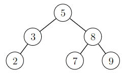
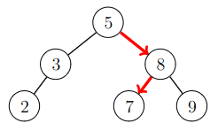
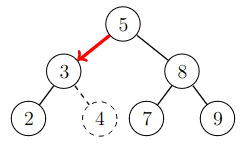
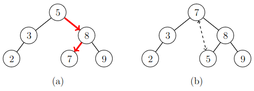

# 12. Binäärihakupuu

_Binäärihakupuu_ (_binary search tree_) on tietorakenne, joka on vaihtoehto hajautukselle. Kuten hajautuksessa, sen avulla voidaan pitää yllä joukkoa alkioita niin, että lisääminen, hakeminen ja poistaminen toimivat tehokkaasti.

Binäärihakupuun keskeinen ero hajautukseen verrattuna on, että se säilyttää alkioita suuruusjärjestyksessä. Tämän ansiosta voidaan etsiä esimerkiksi tehokkaasti joukon pienin tai suurin alkio, mikä ei olisi mahdollista hajautuksen avulla.

Pythonin standardikirjastossa ei ole binäärihakupuun toteutusta, minkä vuoksi sen käyttäminen Pythonissa on hankalampaa kuin hajautuksen käyttäminen. Tässä luvussa toteutamme _itse_ binäärihakupuun Pythonilla.

## Binäärihakupuun toiminta

Binäärihakupuu on binääripuu, jonka jokaisessa solmussa on yksi joukon alkioista. Esimerkiksi seuraava binäärihakupuu vastaa joukkoa $$\{2,3,5,7,8,9\}$$:



Binäärihakupuun alkiot on järjestetty niin, että jokaisessa solmussa kaikki vasemman alipuun alkiot ovat pienempiä kuin solmun alkio ja vastaavasti kaikki oikean alipuun alkiot ovat suurempia kuin alkio. Esimerkiksi yllä olevassa puussa juuressa on alkio $$5$$, minkä vuoksi kaikki vasemman alipuun alkiot ovat pienempiä kuin $$5$$ ja kaikki oikean alipuun alkiot ovat suurempia kuin $$5$$.

Katsotaan seuraavaksi, miten binäärihakupuun avulla voidaan toteuttaa joukkoon liittyviä operaatioita.

### Alkion etsiminen

Kun halutaan etsiä joukosta alkiota, lähdetään liikkeelle puun juuresta. Jos solmussa oleva alkio on pienempi kuin etsittävä alkio, siirrytään oikeaan lapseen. Jos solmussa oleva alkio on suurempi kuin etsittävä alkio, siirrytään vasempaan lapseen. Näin jatketaan, kunnes haluttu alkio on löytynyt tai solmulla ei ole lasta. Jälkimmäinen tapaus tarkoittaa, ettei etsittävää alkiota ole joukossa.

Esimerkiksi alkio $$7$$ voidaan löytää puusta kulkemalla seuraavaa reittiä:



### Alkion lisääminen

Joukkoon voidaan lisätä alkio etsimällä ensin alkiota joukosta. Jos alkio löytyy, sitä ei lisätä, koska sama alkio voi esiintyä joukossa vain kerran. Jos alkiota ei löydy, puuhun lisätään uusi solmu siihen kohtaan, johon haku olisi edennyt seuraavaksi.

Esimerkiksi alkio $$4$$ voidaan lisätä joukkoon seuraavan kuvan mukaisesti solmun $$3$$ oikeaksi lapseksi:



### Pienin alkio

Joukon pienin alkio löytyy lähtemällä liikkeelle juuresta ja etenemällä solmun vasempaan lapseen niin kauan, kuin tämä on mahdollista. Kun tämä ei ole enää mahdollista, pienin alkio on löytynyt.

### Suurin alkio

Tässä voidaan menetellä vastaavasti kuin pienimmän alkion etsimisessä, mutta joka vaiheessa siirrytään solmun oikeaan solmuun.

### Pienin suurempi alkio

Tavoitteena on löytää pienin alkio, joka on suurempi kuin $$x$$. Lähdetään liikkeelle juuresta ja siirrytään vasempaan lapseen aina, kun solmun alkio on suurempi kuin $$x$$, ja muuten oikeaan lapseen. Haku päättyy, kun siirtyminen ei ole mahdollista. Haluttu alkio on pienin alkiota $$x$$ suurempi alkio kaikista alkioista, joiden kautta reitti kulki.

### Suurin pienempi alkio

Tavoitteena on löytää suurin alkio, joka on pienempi kuin $$x$$. Tässä voidaan toimia käänteisesti edelliseen kohtaan verrattuna: siirrytään oikeaan lapseen aina, kun solmun alkio on pienempi kuin $$x$$. Haluttu alkio on suurin alkiota $$x$$ pienempi alkio reitillä olleista alkioista.

### Alkion poistaminen

Kun joukosta halutaan poistaa alkio, etsitään ensin alkiota vastaava solmu puusta. Tässä on kolme mahdollista tapausta:

* Solmulla ei ole lapsia. Tällöin solmu voidaan poistaa suoraan puusta.
* Solmulla on yksi lapsi. Tällöin voidaan poistaa solmu puusta ja siirtää sen tilalle solmun ainoa lapsi.
* Solmulla on kaksi lasta. Tällöin etsitään pienin alkiota suurempi alkio ja vaihdetaan keskenään näiden solmujen alkiot. Tämän jälkeen alkio on helppoa poistaa, koska sen solmulla on enintään yksi lapsi.

Seuraava kuva näyttää esimerkin, jossa halutaan poistaa alkio $$5$$. Koska solmulla on kaksi lasta, vaihdetaan ensin keskenään alkiot $$5$$ ja $$7$$. Tämän jälkeen alkio $$5$$ on helppoa poistaa, koska sillä ei ole lasta.



Huomaa, että kun solmulla on kaksi lasta ja etsitään solmu, jossa on pienin suurempi alkio, tällä solmulla ei voi olla vasenta lasta. Jos solmulla olisi vasen lapsi, siinä oleva alkio olisi pienempi mutta suurempi kuin poistettavan solmun alkio.

## Binäärihakupuun toteutus

Aletaan seuraavaksi toteuttaa binäärihakupuuta Pythonilla. Tavoitteena on saada aikaan luokka `TreeSet`, jota voidaan käyttää seuraavasti:

```python
s = TreeSet()

s.add(1)
s.add(2)
s.add(3)

print(2 in s) # True
print(4 in s) # False

print(s) # [1, 2, 3]
```

Tässä metodi `add` lisää alkion joukkoon, operaattori `in` ilmoittaa, onko alkio joukossa, ja joukon merkkijonoesityksenä on lista sen alkioista.

Seuraava luokka `Node` sisältää tiedon puussa olevasta solmusta:

```python
class Node:
    def __init__(self, value):
        self.value = value
        self.left = None
        self.right = None
```

Jokaiseen solmuun liittyy kolme tietoa: solmussa olevan alkion arvo (`value`) sekä viittaus solmun vasempaan ja oikeaan lapseen (`left` ja `right`).

Luokka `TreeSet` sisältää varsinaisen binäärihakupuun toteutuksen. Tässä on pohja luokalle:

```python
class TreeSet:
    def __init__(self):
        self.root = None
```

Metodi `__init__` luo muuttujan `root`, jossa on viittaus puun juureen. Alussa puussa ei ole yhtään solmua, minkä vuoksi `root` on `None`.

### Alkion lisääminen

Seuraava metodi `add` lisää alkion joukkoon:

```python
    def add(self, value, node=None):
        if node == None:
            if self.root == None:
                self.root = Node(value)
            else:
                self.add(value, self.root)
            return

        if node.value == value:
            return

        if node.value > value:
            if node.left == None:
                node.left = Node(value)
            else:
                self.add(value, node.left)

        if node.value < value:
            if node.right == None:
                node.right = Node(value)
            else:
                self.add(value, node.right)
```

Metodi on toteutettu niin, että `value` on lisättävä alkio ja `node` on käsiteltävä solmu. Kun metodia kutsutaan luokan ulkopuolelta, `node` on `None`, mikä tarkoittaa, että lisääminen alkaa puun juuresta.

Jos puu on tyhjä, alkio lisätään sen juureksi uuteen solmuun ja metodi päättyy. Muuten metodi lisää alkion puuhun rekursiivisesti.

Jos solmun alkio on sama kuin lisättävä alkio, metodi päättyy, koska alkio on jo lisätty. Jos alkio on suurempi, haku jatkuu vasemmalle, ja jos alkio on pienempi, haku jatkuu oikealle. Jos solmulla ei ole lasta, johon haun tulisi jatkua, uusi alkio lisätään kyseiseksi lapseksi ja metodi päättyy.

### Alkion etsiminen

Seuraava metodi `__contains__` tarkastaa, onko joukossa tiettyä alkiota. Metodia `__contains__` kutsutaan, kun koodissa on operaattori `in`.

```python
    def __contains__(self, value, node=None):
        if node == None:
            return self.__contains__(value, self.root)

        if node.value == value:
            return True

        if node.value > value:
            if node.left == None:
                return False
            return self.__contains__(value, node.left)
        else:
            if node.right == None:
                return False
            return self.__contains__(value, node.right)
```

Edellisen metodin tapaan `value` on haettava alkio ja `node` on käsiteltävä solmu. Jos solmussa on haettava alkio, haku palauttaa `True`. Muuten haku liikkuu vasemmalle tai oikealle alkion suuruuden mukaan. Jos liikkuminen ei ole mahdollista, haku palauttaa `False`.

### Merkkijonoesitys

Seuraava metodi `__repr__` muodostaa joukon merkkijonoesityksen, joka sisältää joukon alkiot listana.

```python
    def __repr__(self):
        items = []
        self.traverse(self.root, items)
        return str(items)

    def traverse(self, node, items):
        if node == None:
            return
        self.traverse(node.left, items)
        items.append(node.value)
        self.traverse(node.right, items)
```

Metodi `__repr__` hyödyntää metodia `traverse`, joka käy läpi puun alkiot ja lisää ne listalle. Metodi käy ensin läpi vasemman alipuun, lisää sitten solmun alkion listalle ja käy sen jälkeen vielä läpi oikean alipuun. Tämän ansiosta lista sisältää lopuksi joukon alkiot suuruusjärjestyksessä.

### Muut operaatiot

Tässä toteutuksessa ei ole vielä metodeja pienimpien ja suurimpien alkioiden etsimiseen eikä alkion poistamiseen. Näiden metodien toteuttaminen kuuluu tämän viikon tehtäviin.

## Binäärihakupuun tehokkuus
