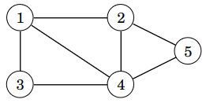
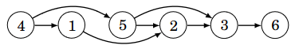

# 13. Suunnatut verkot

Tähän mennessä olemme olettaneet, että verkon kaaria voi kulkea molempiin suuntiin eli verkko on _suuntaamaton_ (_undirected_). Esimerkiksi seuraava verkko on suuntaamaton:



Tässä luvussa tarkastelemme tilannetta, jossa verkon kaarilla on suunnat eli verkko on _suunnattu_ (_directed_). Tällöin kaarissa on nuolet, jotka osoittavat, kumpaan suuntaan kaarta voi kulkea. Esimerkiksi seuraava verkko on suunnattu:


Suunnattuja verkkoja voi käsitellä melko samalla tavalla kuin suuntaamattomia, mutta kaarten suunnat muuttavat joitakin asioita. Tutustumme tässä luvussa algoritmeihin, jotka liittyvät erityisesti suunnattujen verkkojen käsittelyyn.

## Suunnatun verkon esittäminen

Suunnattu verkko voidaan esittää ohjelmoinnissa samaan tapaan vieruslistoina kuin suuntaamaton verkko, mutta kaaret lisätään verkkoon vain toiseen suuntaan. Seuraava luokka soveltuu suunnatun verkon esittämiseen:

```python
class Graph:
    def __init__(self, n):
        self.n = n
        self.graph = {node: [] for node in range(1, n + 1)}
        
    def add_edge(self, a, b):
        self.graph[a].append(b)
```

Luokka on muuten samanlainen kuin suuntaamattoman verkon luokka luvussa 8, mutta metodissa `add_edge` lisätään vain kaari solmusta `a` solmuun `b` eikä kaarta solmusta `b` solmuun `a`.

Nyt äskeinen esimerkkiverkko voidaan luoda näin:

```python
g = Graph(5)

g.add_edge(1, 2)
g.add_edge(2, 4)
g.add_edge(2, 5)
g.add_edge(3, 1)
g.add_edge(4, 1)
g.add_edge(4, 5)
```

Suunnatun verkon käsittelyyn voidaan käyttää syvyyshakua ja leveyshakua samaan tapaan kuin suuntaamattoman verkon käsittelyyn. Koska kaaret on lisätty vain yhteen suuntaan, haut kulkevat verkossa kaarien suuntien mukaisesti.

## Topologinen järjestys

Suunnatun verkon _topologinen järjestys_ (_topological sort_) on solmujen järjestys, joka toteuttaa seuraavan ehdon: jos solmusta $$a$$ pääsee solmuun $$b$$, niin solmu $$a$$ on ennen solmua $$b$$ järjestyksessä.

Tarkastellaan esimerkkinä seuraavaa verkkoa:


Yksi mahdollinen topologinen järjestys tälle verkolle on $$[4,1,5,2,3,6]$$. Seuraavassa kuvassa verkon solmut on aseteltu topologiseen järjestykseen, jolloin kaikki kaaret kulkevat vasemmalta oikealle.



Topologinen järjestys on mahdollista muodostaa, jos verkossa ei ole _sykliä_ (_cycle_) eli verkko on _syklitön_ (_acyclic_). Sykli on verkossa oleva polku, joka palaa takaisin lähtösolmuun. Sykli estää topologisen järjestyksen muodostamisen, koska mitään syklin solmuista ei voi valita tulevaksi ennen muita järjestyksessä.

Suunnatut syklittömät verkot ovat käteviä monissa sovelluksissa. Niistä käytetään joskus englanniksi termiä _dag_, joka tulee sanoista _directed acyclic graph_.

### Topologisen järjestyksen muodostus

Topologinen järjestys voidaan muodostaa suorittamalla verkossa syvyyshakuja. Verkon solmuilla on kolme mahdollista tilaa muodostamisen aikana:

* Tila 0: haku ei ole vielä käynyt solmussa
* Tila 1: solmun käsittely on aloitettu
* Tila 2: solmun käsittely on saatu loppuun

Algoritmin alussa jokaisen solmun tila on 0. Algoritmi käy läpi verkon solmut ja aloittaa syvyyshaun jokaisesta solmusta, jonka tila on 0. Kun haku saapuu solmuun, solmun tilaksi tulee 1. Kun haku on käynyt läpi kaikki solmusta lähtevät kaaret, solmun tilaksi tulee 2.

Algoritmi muodostaa listan, joka sisältää verkon solmut. Kukin solmu lisätään listalle siinä vaiheessa, kun solmun tilaksi tulee 2. Algoritmin päätteeksi tämä lista käännettynä ympäri on yksi verkon topologinen järjestys.

Jos verkossa on sykli, tämä havaitaan algoritmin aikana siitä, että haku tulee solmuun, jonka tilana on 1. Tällöin verkossa on sykli eikä topologisen järjestyksen muodostaminen ole mahdollista.

Seuraavassa on algoritmin toteutus Pythonilla:

```python
class TopologicalSort:
    def __init__(self, n):
        self.n = n
        self.graph = {node: [] for node in range(1, n + 1)}
        
    def add_edge(self, a, b):
        self.graph[a].append(b)
        
    def visit(self, node):
        if self.state[node] == 1:
            self.cycle = True
            return
        if self.state[node] == 2:
            return

        self.state[node] = 1
        for next_node in self.graph[node]:
            self.visit(next_node)

        self.state[node] = 2
        self.order.append(node)
        
    def create(self):
        self.state = {}
        for node in range(1, self.n + 1):
            self.state[node] = 0

        self.order = []
        self.cycle = False
        
        for node in range(1, self.n + 1):
            if self.state[node] == 0:
                self.visit(node)
                
        if self.cycle:
            return None
        else:
            self.order.reverse()
            return self.order        
```

Algoritmia voidaan käyttää näin esimerkkiverkossa:

```python
t = TopologicalSort(6)

t.add_edge(1, 2)
t.add_edge(2, 3)
t.add_edge(3, 6)
t.add_edge(4, 1)
t.add_edge(4, 5)
t.add_edge(5, 2)
t.add_edge(5, 3)

print(t.create()) # [4, 5, 1, 2, 3, 6]
```

Huomaa, että algoritmin antama topologinen järjestys $$[4,5,1,2,3,6]$$ on eri kuin aiempi topologinen järjestys $$[4,1,5,2,3,6]$$. Tämä johtuu siitä, että verkolla voi olla useita topologisia järjestyksiä ja algoritmi löytää yhden niistä.

### Miksi algoritmi toimii?

Algoritmin toiminnan voi perustella sillä, että kun verkossa on kaari solmusta $$a$$ solmuun $$b$$, solmun $$a$$ tilaksi tulee 2 myöhemmin kuin solmun $$a$$ tilaksi tulee 2. Niinpä algoritmi lisää solmun $$a$$ listaan myöhemmin kuin solmun $$b$$.

Tämän ansiosta kun lista käännetään lopuksi, solmu $$a$$ on topologisessa järjestyksessä ennen solmua $$b$$. Tämä takaa, että kaikki kaaret kulkevat vasemmalta oikealle topologisessa järjestyksessä.

Jos verkossa on sykli, haku päätyy jossain vaiheessa johonkin syklissä olevista solmuista ja kulkee kaaria eteenpäin niin, että se päätyy uudestaan samaan solmuun. Niinpä algoritmi onnistuu tunnistamaan tilanteen, jossa verkossa on sykli.

## Dynaaminen ohjelmointi

Suunnattujen syklittömien verkkojen käsittelyyn voidaan käyttää dynaamista ohjelmointia. Dynaamisella ohjelmoinnilla voidaan vastata esimerkiksi seuraaviin polkuihin liittyviin kysymyksiin:

* Montako erilaista polkua on solmusta $$a$$ solmuun $$b$$?
* Mikä on pienin määrä kaaria polulla solmusta $$a$$ solmuun $$b$$?
* Mikä on suurin määrä kaaria polulla solmusta $$a$$ solmuun $$b$$?

Kun verkossa ei ole syklejä, verkkoa voidaan käsitellä kätevästi dynaamisen ohjelmoinnin avulla. Tarkastellaan esimerkkinä polkujen määrän laskemista seuraavassa verkossa:


Tässä verkossa on $$3$$ erilaista polkua solmusta $$4$$ solmuun $$3$$:

* $$4 \rightarrow 1 \rightarrow 2 \rightarrow 3$$ <span></span>
* $$4 \rightarrow 5 \rightarrow 2 \rightarrow 3$$ <span></span>
* $$4 \rightarrow 5 \rightarrow 3$$ <span></span>

Kun halutaan laskea polut solmusta $$4$$ solmuun $$3$$, laskenta voidaan jakaa kahteen osaongelmaan:

* Polun ensimmäinen kaari on $$4 \rightarrow 1$$. Tässä tapauksessa lasketaan mukaan polut solmusta $$1$$ solmuun $$3$$.
* Polun ensimmäinen kaari on $$4 \rightarrow 5$$. Tässä tapauksessa lasketaan mukaan polut solmusta $$5$$ solmuun $$3$$.

Solmusta $$1$$ on $$1$$ polku solmuun $$3$$ ja solmusta $$5$$ on $$2$$ polkua solmuun $$3$$, joten polkuja solmusta $$4$$ solmuun $$3$$ on yhteensä $$1+2=3$$.

Yleisemmin kun halutaan laskea polkujen määrä solmusta $$x$$ solmuun $$y$$, voidaan käydä läpi kaikki solmut, joihin pääsee kaarella solmusta $$x$$. Polkujen määrä on yhtä suuri kuin summa kaikkien näiden solmujen polkujen määristä. Koska verkossa ei ole syklejä, määrät voidaan laskea dynaamisella ohjelmoinnilla.

Seuraava koodi toteuttaa algoritmin Pythonilla:

```python
class CountPaths:
    def __init__(self, n):
        self.n = n
        self.graph = {node: [] for node in range(1, n + 1)}
        
    def add_edge(self, a, b):
        self.graph[a].append(b)
        
    def count_from(self, node):
        if node in self.result:
            return self.result[node]
        
        path_count = 0
        for next_node in self.graph[node]:
            path_count += self.count_from(next_node)
        
        self.result[node] = path_count
        return path_count
        
    def count_paths(self, x, y):
        self.result = {y: 1}
        return self.count_from(x)
```

Koodia voidaan käyttää näin:

```python
c = CountPaths(6)

c.add_edge(1, 2)
c.add_edge(2, 3)
c.add_edge(3, 6)
c.add_edge(4, 1)
c.add_edge(4, 5)
c.add_edge(5, 2)
c.add_edge(5, 3)

print(c.count_paths(4, 3)) # 3
```

Tässä dynaaminen ohjelmointi on toteutettu tallentamalla sanakirjaan `result` jokaisesta solmusta polkujen määrä kohdesolmuun. Jos polkujen määrä on jo laskettu, sitä ei lasketa uudestaan, minkä ansiosta algoritmi toimii tehokkaasti.

### Ongelmien esittäminen verkkoina

Dynaaminen ohjelmointi voidaan yleensäkin nähdä suunnattomien syklittömien verkkojen käsittelynä. Tarkastellaan esimerkkinä seuraavaa tehtävää, joka ratkaistiin dynaamisella ohjelmoinnilla luvussa 10:

{: .note-title }
Tehtävä
<div class="note" markdown="1">

Käytössäsi on rajaton määrä kolikkoja, joiden arvot annetaan listassa. Montako eri tapaa on muodostaa kolikoista summa $$x$$?

Esimerkiksi kun kolikot ovat $$[1,3,4]$$ ja $$x=6$$, tapoja on $$9$$:

* $$[1,1,1,1,1,1]$$<span></span>
* $$[1,1,1,3]$$<span></span>
* $$[1,1,4]$$<span></span>
* $$[1,1,3,1]$$<span></span>
* $$[1,3,1,1]$$<span></span>
* $$[1,4,1]$$<span></span>
* $$[3,1,1,1]$$<span></span>
* $$[3,3]$$<span></span>
* $$[4,1,1]$$<span></span>


</div>

Tämä ongelma voidaan esittää verkkona, jossa jokainen solmu vastaa rahamäärää $$0,1,\dots,x$$ ja solmusta $$a$$ on kaari solmuun $$b$$, jos rahamäärästä $$a$$ pääsee yhdellä kolikolla rahamäärään $$b$$. Kun kolikot ovat $$[1,3,4]$$ ja $$x=6$$, verkko on seuraava:


Tässä verkossa jokainen polku solmusta $$0$$ solmuun $$x$$ tarkoittaa yhtä tapaa, miten rahamäärä voidaan muodostaa. Niinpä polkujen määrä solmusta $$0$$ solmuun $$x$$ on yhtä suuri kuin erilaisten tapojen määrä. Voisimme siis käyttää melkein suoraan äskeistä luokkaa `CountPaths` tehtävän ratkaisemiseen.

## Vahvasti yhtenäisyys
