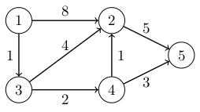

# 14. Lyhimmät polut

Tässä luvussa tarkastelemme tilannetta, jossa verkko on _painotettu_ (_weighted_) eli jokaisella kaarella on paino. Tällaisessa verkossa polun pituus on summa polulla olevien kaarten painoista.

Seuraavassa kuvassa on esimerkki painotetusta verkosta:



Tässä verkossa esimerkiksi polun $$1 \rightarrow 3 \rightarrow 2$$ pituus on $$1+4=5$$, koska kaaren $$1 \rightarrow 3$$ paino on $$1$$ ja kaaren $$3 \rightarrow 2$$ paino on $$4$$.

Olemme käyttäneet aiemmin leveyshakua verkon lyhimpien polkujen etsimiseen, mutta algoritmi ei sovellu käytettäväksi painotetuissa verkoissa. Tässä luvussa tutustumme kolmeen algoritmiin, joilla voidaan etsiä lyhimpiä polkuja painotetuissa verkoissa.

## Bellman-Ford-algoritmi

Bellman-Ford-algoritmi etsii lyhimmät polut alkusolmusta kaikkiin verkon solmuihin. Algoritmi pitää yllä tietoa etäisyyksistä verkon solmuihin. Alussa etäisyys alkusolmuun on $$0$$ ja etäisyys kaikkiin muihin solmuihin on $$\infty$$.

Algoritmi muodostuu $$n-1$$ kierroksesta. Jokaisella kierroksella algoritmi käy läpi kaikki verkon kaaret ja koettaa pienentää etäisyyksiä kaarten avulla. Kun kaari on solmusta $$a$$ solmuun $$b$$, algoritmi tarkastaa, saadaanko kaaren avulla pienempi etäisyys solmun $$a$$ kautta solmuun $$b$$. Jos etäisyys on pienempi, algoritmi merkitsee muistiin uuden etäisyyden.

Bellman-Ford-algoritmi voidaan toteuttaa seuraavasti:

```python
class BellmanFord:
    def __init__(self, n):
        self.n = n
        self.edges = []
        
    def add_edge(self, a, b, w):
        self.edges.append((a, b, w))
        
    def find_paths(self, start_node):
        self.distances = {}
        for node in range(1, self.n + 1):
            self.distances[node] = float("inf")
        self.distances[start_node] = 0
        
        for _ in range(self.n - 1):
            for edge in self.edges:
                a, b, w = edge
                new_distance = self.distances[a] + w
                if new_distance < self.distances[b]:
                    self.distances[b] = new_distance
```

Algoritmin käytössä on lista `edges`, joka sisältää kunkin kaaren alku- ja loppusolmun sekä painon. Tämän avulla algoritmin kierroksissa on kätevää käydä läpi kaikki verkon kaaret. Algoritmi muodostaa sanakirjan `distances`, jossa on etäisyys alkusolmusta kuhunkin solmuun.

Algoritmia voidaan käyttää näin:

```python
b = BellmanFord(5)

b.add_edge(1, 2, 8)
b.add_edge(1, 3, 1)
b.add_edge(2, 5, 5)
b.add_edge(3, 2, 4)
b.add_edge(3, 4, 2)
b.add_edge(4, 2, 1)
b.add_edge(4, 5, 3)

b.find_paths(1)
print(b.distances) # {1: 0, 2: 4, 3: 1, 4: 3, 5: 6}
```

Seuraava taulukko näyttää etäisyydet solmusta $$1$$ muihin solmuihin ja etäisyyksiä vastaavat polut:

Kohdesolmu | Etäisyys | Polku
== | == | ==
$$1$$ | $$0$$ | $$1$$
$$2$$ | $$4$$ | $$1 \rightarrow 3 \rightarrow 4 \rightarrow 2$$
$$3$$ | $$1$$ | $$1 \rightarrow 3$$
$$4$$ | $$3$$ | $$1 \rightarrow 3 \rightarrow 4$$
$$5$$ | $$6$$ | $$1 \rightarrow 3 \rightarrow 4 \rightarrow 5$$

### Algoritmin tutkiminen

Algoritmin toiminnasta saa paremman kuvan lisäämällä siihen tulostuksen aina, kun algoritmi muuttaa etäisyyttä:

```python
                if new_distance < self.distances[b]:
                    print("update", a, b, new_distance)
                    self.distances[b] = new_distance
```

Tämän jälkeen algoritmin tulostus äskeisessä verkossa on seuraava:

```python
update 1 2 8
update 1 3 1
update 2 5 13
update 3 2 5
update 3 4 3
update 4 2 4
update 4 5 6
```

Tässä jokainen rivi näyttää yhden algoritmin tekemän muutoksen etäisyyksiin. Ensimmäinen muutos on, että solmun $$2$$ etäisyydeksi tulee $$8$$. Tässä käytetään kaarta $$1 \rightarrow 2$$, jonka paino on $$8$$. Koska etäisyys solmuun $$1$$ on $$0$$, tämän kaaren avulla saadaan uusi etäisyys $$8$$, joka korvaa vanhan etäisyyden $$\infty$$.

Tästä huomaa, että etäisyys solmuun saattaa muuttua useita kertoja algoritmin aikana. Esimerkiksi etäisyys solmuun $$2$$ on ensin $$\infty$$, sitten $$8$$ kaaren $$1 \rightarrow 2$$ kautta, sitten $$5$$ kaaren $$3 \rightarrow 2$$ kautta ja lopulta $$4$$ kaaren $$4 \rightarrow 2$$ kautta.

### Algoritmin analyysi

Kun Bellman-Ford-algoritmin ensimmäisen kierroksen jälkeen se on löytänyt kaikki lyhimmät polut, joissa on yksi kaari. Algoritmin toisen kierroksen jälkeen se on löytänyt kaikki lyhimmät polut, joissa on kaksi kaarta. Yleisemmin $$k$$ kierroksen jälkeen algoritmi on löytänyt kaikki lyhimmät polut, joissa on $$k$$ kaarta.

Kun verkossa on $$n$$ solmua, jokaisessa lyhimmässä polussa on enintään $$n-1$$ kaarta. Tämä johtuu siitä, että jos polussa olisi $$n$$ tai enemmän kaaria, se kävisi monta kertaa samassa solmussa. Tällainen polku ei kuitenkaan voisi olla lyhin polku. Niinpä $$n-1$$ kierroksen jälkeen algoritmi on löytänyt kaikki lyhimmät polut.

Koska algoritmi suorittaa $$n-1$$ kierrosta ja käy läpi jokaisella kierroksella $$m$$ kaarta, algoritmin aikavaativuus on $$O(nm)$$.

### Negatiiviset syklit

Bellman-Ford-algoritmi ei anna mielekästä tulosta, jos verkossa on negatiivinen sykli. Negatiivinen sykli tarkoittaa sykliä, jossa kaarten yhteispaino on negatiivinen. Tällaista sykliä kulkemalla polkuja voi lyhentää loputtomasti, jolloin lyhimmän polun käsite ei ole hyvin määritelty.

Seuraavassa on esimerkki tilanteesta, jossa verkossa on negatiivinen sykli:

```python
b = BellmanFord(4)

b.add_edge(1, 2, 1)
b.add_edge(2, 3, 1)
b.add_edge(3, 2, -2)
b.add_edge(2, 4, 1)

b.find_paths(1)
print(b) # {1: 0, 2: -2, 3: 0, 4: -1}
```

Verkossa on kaari $$2 \rightarrow 3$$ painolla $$1$$ sekä kaari $$3 \rightarrow 2$$ painolla $$-2$$. Kun kuljetaan näitä kaaria edestakaisin, polun pituus vähenee aina $$1$$:llä. Tämän takia polun pituus solmusta $$1$$ mihin tahansa muuhun solmuun saadaan miten pieneksi tahansa. Tässä tapauksessa algoritmin antama tulos ei ole mielekäs.

Algoritmin avulla voidaan kuitenkin havaita verkossa oleva negatiivinen sykli. Tämä voidaan tehdä suorittamalla algoritmia $$n$$ kierrosta tavallisen $$n-1$$ sijasta. Verkossa on negatiivinen sykli, jos jokin etäisyys paranee vielä viimeisellä kierroksella.


## Dijkstran algoritmi

## Floyd-Warshall-algoritmi
