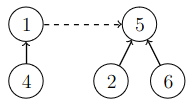

# 15. Komponentit ja virittävät puut

## Union-find-rakenne

Union-find-rakenne on tietorakenne, joka pitää yllä tietoa siitä, miten alkiot ovat jakautuneet joukkoihin. Aluksi jokainen alkio on omassa joukossaan. Tietorakenne tarjoaa kaksi tehokasta operaatiota:

* Tarkasta, kuuluvatko kaksi alkiota samaan joukkoon
* Yhdistä kaksi joukkoa samaksi joukoksi

Union-find-rakenne on toteutettu niin, että jokaisessa joukossa yksi alkioista on joukon edustaja. Kaikista muista joukon alkioista on viittaus edustajaan suoraan tai muiden alkioiden kautta. Näiden viittausten avulla voidaan selvittää sen joukon edustaja, johon tietty alkio kuuluu.

Tarkastellaan esimerkkinä union-find-rakennetta, joka sisältää alkiot $$1,2,\dots,8$$. Seuraavassa kuvassa joukot ovat $$\{1,4\}$$, $$\{2,5,6\}$$ sekä $$\{3,7,8\}$$:


Tässä joukkojen edustajat ovat $$1$$, $$5$$ ja $$3$$. Kaikista muista alkioista päästään viittausten avulla edustajiin. Esimerkiksi alkiosta $$2$$ päästään edustajaan polkua $$2 \rightarrow 5$$ ja alkiosta $$8$$ päästään edustajaan polkua $$8 \rightarrow 7 \rightarrow 3$$.

Kaksi alkiota kuuluvat samaan joukkoon, jos niillä on yhteinen edustaja. Esimerkiksi solmut $$2$$ ja $$6$$ kuuluvat samaan joukkoon, koska molempien joukkojen edustaja on $$5$$. Solmut $$2$$ ja $$4$$ puolestaan kuuluvat eri joukkoihin, koska solmun $$2$$ joukon edustaja on $$5$$ ja solmun $$3$$ joukon edustaja on $$3$$.

Kun kaksi joukkoa yhdistetään, toisen joukon edustaja asetetaan viittaamaan toisen joukon edustajaan, josta tulee koko uuden joukon edustaja. Esimerkiksi seuraava kuva näyttää, miten joukot $$\{1,4\}$$ ja $$\{2,5,6\}$$ voidaan yhdistää:



Tämän seurauksena syntyy uusi joukko $$\{1,2,4,5,6\}$$, jonka edustaja on $$5$$. Yhdistämisen jälkeen kaikista joukon alkioista pääsee polkua pitkin edustajaan. Esimerkiksi alkiosta $$4$$ päästään edustajaan polkua $$4 \rightarrow 1 \rightarrow 5$$.

Union-find-rakenteen tehokkuus riippuu siitä, miten nopeasti tietyn alkion edustaja voidaan löytää. Mitä lyhempiä viittausten muodostamat polut ovat, sitä tehokkaammin edustajat voi löytää. Polkujen pituutta voidaan rajata toteuttamalla joukkojen yhdistämiset niin, että ne eivät tuota pitkiä polkuja.

Kun kaksi joukkoa yhdistetään, on kaksi tapaa valita, kumman joukon edustaja alkaa viitata toisen joukon edustajaan. Hyvä valinta on, että _pienemmän_  joukon edustaja alkaa viitata _suuremman_ joukon edustajaan. Tällöin jokaisen polun pituus on luokkaa $$O(\log n)$$ ja voidaan tarkastaa tehokkaasti, ovatko kaksi alkiota samassa joukossa.

Union-find-rakenne voidaan toteuttaa seuraavasti:

```python
class UnionFind:
    def __init__(self, n):
        self.link = {node: None for node in range(1, n + 1)}
        self.size = {node: 1 for node in range(1, n + 1)}
            
    def find(self, x):
        while self.link[x]:
            x = self.link[x]
        return x

    def union(self, a, b):
        a = self.find(a)
        b = self.find(b)
        if a == b: return
 
        if self.size[a] > self.size[b]:
            a, b = b, a
        self.link[a] = b
        self.size[b] += self.size[a]        
```

Sanakirja `link` sisältää solmujen viittaukset toisiin solmuihin. Sanakirja `size` puolestaan kertoo jokaisen edustajan joukon koon.

Metodi `find` etsii solmun `x` edustajan kulkemalla viittausten muodostamaa polkua. Metodi `union` yhdistää joukot, joihin kuuluvat solmut `a` ja `b`. Metodi etsii ensin joukkojen edustajat. Tämän jälkeen pienemmän joukon edustaja alkaa viitata suuremman joukon edustajaan ja suuremman joukon edustajan koko päivitetään.

Seuraava koodi esittelee luokan käyttämistä:

```python
u = UnionFind(8)

u.union(1, 4)
u.union(2, 5)
u.union(5, 6)
u.union(3, 7)
u.union(7, 8)

print(u.find(1)) # 4
print(u.find(2)) # 5
print(u.find(3)) # 7
print(u.find(4)) # 4
print(u.find(5)) # 5
print(u.find(6)) # 5
print(u.find(7)) # 7
print(u.find(8)) # 7
```

Tässä tapauksessa joukon $$\{1,4\}$$ edustaja on $$4$$, joukon $$\{2,5,6\}$$ edustaja on $$5$$ ja joukon $$\{3,7,8\}$$ edustaja on $$7$$.

## Esimerkki: Uudet tiet

{: .note-title }
Tehtävä
<div class="note" markdown="1">

Bittimaassa on $$n$$ kaupunkia mutta ei vielä yhtään tietä. Tehtäväsi on laatia luokka `NewRoads`, jossa on seuraavat metodit:

* `add_road`: lisää tien kahden kaupungin välille
* `has_route`: tarkastaa, pystyykö kahden kaupungin välillä matkustamaan teitä pitkin

Kummankin metodin tulee toimia tehokkaasti.

</div>

Tehtävä voidaan ratkaista seuraavasti union-find-rakenteen avulla:

```python
class NewRoads:
    def __init__(self, n):
        self.uf = UnionFind(n)
        
    def add_road(self, a, b):
        self.uf.union(a, b)
        
    def has_route(self, a, b):
        return self.uf.find(a) == self.uf.find(b)
```

Ideana on, että union-find-rakenteen joukot vastaavat verkon komponentteja. Aluksi jokainen alkio on omassa joukossaan, mikä tarkoittaa, että jokainen solmu on omassa komponentissaan.

Metodi `add_road` kutsuu metodia `union`, joka yhdistää verkon komponentit. Metodi `has_route` puolestaan kutsuu kummallekin alkiolle metodia `find`. Alkiot kuuluvat samaan komponenttiin, jos `find` antaa niille saman edustajan.

Tässä ratkaisussa metodin `add_road` aikavaativuus on $$O(1)$$ ja metodin `has_route` aikavaativuus on $$O(\log n)$$.

## Virittävät puut

## Kruskalin algoritmi
