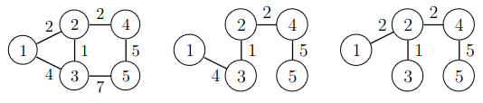

# 15. Komponentit ja virittävät puut

## Union-find-rakenne

Union-find-rakenne on tietorakenne, joka pitää yllä tietoa siitä, miten alkiot ovat jakautuneet joukkoihin. Aluksi jokainen alkio on omassa joukossaan. Tietorakenne tarjoaa kaksi tehokasta operaatiota:

* Tarkasta, kuuluvatko kaksi alkiota samaan joukkoon
* Yhdistä kaksi joukkoa samaksi joukoksi

Union-find-rakenne on toteutettu niin, että jokaisessa joukossa yksi alkioista on joukon edustaja. Kaikista muista joukon alkioista on viittaus edustajaan suoraan tai muiden alkioiden kautta. Näiden viittausten avulla voidaan selvittää sen joukon edustaja, johon tietty alkio kuuluu.

Tarkastellaan esimerkkinä union-find-rakennetta, joka sisältää alkiot $$1,2,\dots,8$$. Seuraavassa kuvassa joukot ovat $$\{1,4\}$$, $$\{2,5,6\}$$ sekä $$\{3,7,8\}$$:


Tässä joukkojen edustajat ovat $$1$$, $$5$$ ja $$3$$. Kaikista muista alkioista päästään viittausten avulla edustajiin. Esimerkiksi alkiosta $$2$$ päästään edustajaan polkua $$2 \rightarrow 5$$ ja alkiosta $$8$$ päästään edustajaan polkua $$8 \rightarrow 7 \rightarrow 3$$.

Kaksi alkiota kuuluvat samaan joukkoon, jos niillä on yhteinen edustaja. Esimerkiksi solmut $$2$$ ja $$6$$ kuuluvat samaan joukkoon, koska molempien joukkojen edustaja on $$5$$. Solmut $$2$$ ja $$4$$ puolestaan kuuluvat eri joukkoihin, koska solmun $$2$$ joukon edustaja on $$5$$ ja solmun $$3$$ joukon edustaja on $$3$$.

Kun kaksi joukkoa yhdistetään, toisen joukon edustaja asetetaan viittaamaan toisen joukon edustajaan, josta tulee koko uuden joukon edustaja. Esimerkiksi seuraava kuva näyttää, miten joukot $$\{1,4\}$$ ja $$\{2,5,6\}$$ voidaan yhdistää:


Tämän seurauksena syntyy uusi joukko $$\{1,2,4,5,6\}$$, jonka edustaja on $$5$$. Yhdistämisen jälkeen kaikista joukon alkioista pääsee polkua pitkin edustajaan. Esimerkiksi alkiosta $$4$$ päästään edustajaan polkua $$4 \rightarrow 1 \rightarrow 5$$.

Union-find-rakenteen tehokkuus riippuu siitä, miten nopeasti tietyn alkion edustaja voidaan löytää. Mitä lyhempiä viittausten muodostamat polut ovat, sitä tehokkaammin edustajat voi löytää. Polkujen pituutta voidaan rajata toteuttamalla joukkojen yhdistämiset niin, että ne eivät tuota pitkiä polkuja.

Kun kaksi joukkoa yhdistetään, on kaksi tapaa valita, kumman joukon edustaja alkaa viitata toisen joukon edustajaan. Hyvä valinta on, että _pienemmän_  joukon edustaja alkaa viitata _suuremman_ joukon edustajaan. Tällöin jokaisen polun pituus on luokkaa $$O(\log n)$$ ja voidaan tarkastaa tehokkaasti, ovatko kaksi alkiota samassa joukossa.

Union-find-rakenne voidaan toteuttaa seuraavasti:

```python
class UnionFind:
    def __init__(self, n):
        self.link = {node: None for node in range(1, n + 1)}
        self.size = {node: 1 for node in range(1, n + 1)}
            
    def find(self, x):
        while self.link[x]:
            x = self.link[x]
        return x

    def union(self, a, b):
        a = self.find(a)
        b = self.find(b)
        if a == b: return
 
        if self.size[a] > self.size[b]:
            a, b = b, a
        self.link[a] = b
        self.size[b] += self.size[a]        
```

Sanakirja `link` sisältää solmujen viittaukset toisiin solmuihin. Sanakirja `size` puolestaan kertoo jokaisen edustajan joukon koon.

Metodi `find` etsii solmun `x` edustajan kulkemalla viittausten muodostamaa polkua. Metodi `union` yhdistää joukot, joihin kuuluvat solmut `a` ja `b`. Metodi etsii ensin joukkojen edustajat. Tämän jälkeen pienemmän joukon edustaja alkaa viitata suuremman joukon edustajaan ja suuremman joukon edustajan koko päivitetään.

Seuraava koodi esittelee luokan käyttämistä:

```python
u = UnionFind(8)

u.union(1, 4)
u.union(2, 5)
u.union(5, 6)
u.union(3, 7)
u.union(7, 8)

print(u.find(1)) # 4
print(u.find(2)) # 5
print(u.find(3)) # 7
print(u.find(4)) # 4
print(u.find(5)) # 5
print(u.find(6)) # 5
print(u.find(7)) # 7
print(u.find(8)) # 7
```

Tässä tapauksessa joukon $$\{1,4\}$$ edustaja on $$4$$, joukon $$\{2,5,6\}$$ edustaja on $$5$$ ja joukon $$\{3,7,8\}$$ edustaja on $$7$$.

## Esimerkki: Uudet tiet

{: .note-title }
Tehtävä
<div class="note" markdown="1">

Bittimaassa on $$n$$ kaupunkia mutta ei vielä yhtään tietä. Tehtäväsi on laatia luokka `NewRoads`, jossa on seuraavat metodit:

* `add_road`: lisää tien kahden kaupungin välille
* `has_route`: tarkastaa, pystyykö kahden kaupungin välillä matkustamaan teitä pitkin

Kummankin metodin tulee toimia tehokkaasti.

</div>

Tehtävä voidaan ratkaista seuraavasti union-find-rakenteen avulla:

```python
class NewRoads:
    def __init__(self, n):
        self.uf = UnionFind(n)
        
    def add_road(self, a, b):
        self.uf.union(a, b)
        
    def has_route(self, a, b):
        return self.uf.find(a) == self.uf.find(b)
```

Ideana on, että union-find-rakenteen joukot vastaavat verkon komponentteja. Aluksi jokainen alkio on omassa joukossaan, mikä tarkoittaa, että jokainen solmu on omassa komponentissaan.

Metodi `add_road` kutsuu metodia `union`, joka yhdistää verkon komponentit. Metodi `has_route` puolestaan kutsuu kummallekin alkiolle metodia `find`. Alkiot kuuluvat samaan komponenttiin, jos `find` antaa niille saman edustajan.

Tässä ratkaisussa metodin `add_road` aikavaativuus on $$O(1)$$ ja metodin `has_route` aikavaativuus on $$O(\log n)$$.

## Puut verkoissa

Suuntaamaton verkko on _puu_ (_tree_), jos verkko on yhtenäinen ja syklitön. Esimerkiksi seuraava verkko on puu:


Tässä tapauksessa puussa ei ole juurta eikä muutenkaan kerroksia, joissa solmut olisivat. Kuitenkin puun lehtiä ovat kaikki solmut, joiden aste on $$1$$ eli joihin liittyy vain yksi kaari. Esimerkiksi yllä olevassa puussa lehtiä ovat solmut $$1$$, $$2$$ ja $$5$$.

Kun verkko on puu ja siinä on $$n$$ solmua, siinä on aina tasan $$n-1$$ kaarta. Jos puusta poistetaan kaari, se ei ole enää yhtenäinen. Jos taas puuhun lisätään kaari, se ei ole enää syklitön.

Verkon _virittävä puu_ (_spanning tree_) on puu, joka sisältää verkon solmut ja jonkin osajoukon sen kaarista. Seuraavassa kuvassa on vasemmalla verkko ja oikealla yksi sen virittävistä puista:


Verkolle voidaan muodostaa yleensä useita erilaisia virittäviä puita, koska on monia tapoja valita kaaria niin, että tuloksena on puu.

Kun verkko on painotettu, virittävän puun paino saadaan laskemalla yhteen puuhun valittujen kaarten painot. Tarkastellaan esimerkkinä seuraavaa kuvaa, jossa on painotettu verkko ja kaksi sen virittävää puuta:



Ensimmäisen virittävän puun paino on $$4+1+2+5=12$$, ja toisen virittävän puun paino on $$2+1+2+5=10$$.

Tässä tapauksessa toinen virittävä puu on verkon _pienin virittävä puu_ (_minimum spanning tree_) eli virittävä puu, jonka paino on pienin mahdollinen. Myös pienimmän virittävän puun valintaan voi olla useita mahdollisuuksia.

## Kruskalin algoritmi

Kruskalin algoritmi on union-find-rakennetta käyttävä algoritmi, jolla voidaan muodostaa verkon pienin virittävä puu. Algoritmi käy läpi verkon kaaret painojärjestyksessä ja valitsee virittävään puuhun mukaan kaikki kaaret, jotka eivät aiheuta sykliä.

Esimerkiksi äskeisen verkon tapauksessa algoritmi toimii seuraavasti:

Kaari | Paino | Mukaan puuhun?
$$2-3$$ | $$1$$ | Kyllä
$$1-2$$ | $$2$$ | Kyllä
$$2-4$$ | $$2$$ | Kyllä
$$1-3$$ | $$4$$ | Ei
$$4-5$$ | $$5$$ | Kyllä
$$3-5$$ | $$7$$ | Ei

Algoritmi ottaa mukaan puuhun ensin kaaret $$2-3$$, $$1-2$$ ja $$2-4$$. Kaari $$1-3$$ ei tule mukaan, koska se aiheuttaisi syklin. Sitten mukaan tulee vielä kaari $$4-5$$, jonka lisäämisen jälkeen pienin virittävä puu on valmis.

Kruskalin algoritmi voidaan toteuttaa tehokkaasti union-find-rakenteen avulla, koska sen avulla voidaan tarkastaa, tuleeko kaari lisätä mukaan virittävään puuhun. Jos kaaren päissä olevat solmut ovat eri komponenteissa, kaari lisätään virittävään puuhun eikä se aiheuta sykliä.

Seuraava luokka toteuttaa Kruskalin algoritmin:

```python
class Kruskal:
    def __init__(self, n):
        self.edges = []
        self.uf = UnionFind(n)
        
    def add_edge(self, node_a, node_b, weight):
        self.edges.append((node_a, node_b, weight))
        
    def construct(self):
        self.edges.sort(key=lambda x: x[2])
        tree_weight = 0
        
        for edge in self.edges:
            node_a, node_b, weight = edge
            if self.uf.find(node_a) != self.uf.find(node_b):
                self.uf.union(node_a, node_b)
                tree_weight += weight
                
        return tree_weight     
```

Metodi `construct` muodostaa pienimmän virittävän puun ja palauttaa puun painon. Metodi järjestää ensin kaarilistan kaarten painojen mukaan. Tämän jälkeen metodi käy läpi kaaret ja valitsee kaaret puuhun union-find-rakenteen avulla. Kun kaari valitaan puuhun, sen paino lisätään puun painoon.

Luokkaa voidaan käyttää seuraavasti:

```python
k = Kruskal(5)

k.add_edge(1, 2, 2)
k.add_edge(1, 3, 4)
k.add_edge(2, 3, 1)
k.add_edge(2, 4, 2)
k.add_edge(3, 5, 7)
k.add_edge(4, 5, 5)

print(k.construct()) # 10
```

### Miksi algoritmi toimii?

Kruskalin algoritmi muodostaa virittävän puun ahneesti kaarten painojärjestyksen perusteella. Miksi algoritmi tuottaa varmasti pienimmän virittävän puun?

Tarkastellaan tilannetta, jossa seuraavana järjestyksessä oleva kaari on $$a-b$$ ja solmut $$a$$ ja $$b$$ ovat eri komponenteissa. Jos kaarta $$a-b$$ ei valita puuhun, täytyy valita myöhemmin jokin toinen kaari, joka liittää solmut $$a$$ ja $$b$$ samaan komponenttiin.

Kuitenkin myöhemmin valittu kaari voidaan korvata kaarella $$a-b$$ niin, että tuloksena on edelleen virittävä puu. Koska myöhemmin valitun kaaren paino on yhtä suuri tai suurempi kuin kaaren $$a-b$$ paino, tämä ei lisää virittävän puun painoa. Niinpä on turvallista valita kaari $$a-b$$ puuhun.
